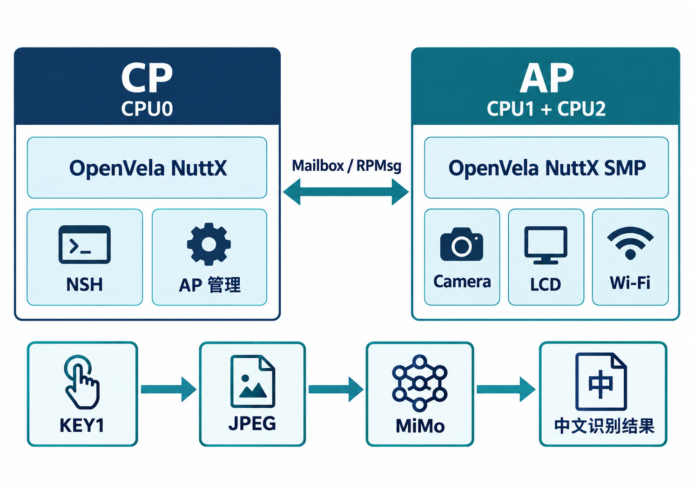

# BK7258 R1 视觉辅助胸牌

2026 首届 openvela AI 硬件开发者大赛 · 队伍 441「不知道叫什么名字」· 新硬件平台适配

本作品将 BK7258 R1 开发板的 CP 与 AP 均适配到 OpenVela/NuttX：物理 CPU0 运行 CP 系统，物理 CPU1、CPU2 运行 AP SMP 系统。视觉辅助胸牌通过 KEY1 短按采集图像，经 Wi-Fi 向 MiMo 发起视觉问答，并在串口输出中文识别结果；双屏 LCD 显示眨眼动画。



## 作品能力

| 模块 | 实现与验证 |
| --- | --- |
| 多核系统 | CP/AP OpenVela 启动；AP READY、RPTUN CONNECTED、CPU2 SCHEDULER_ONLINE、AP SMP PASSED 均有实机串口记录 |
| 视觉交互 | KEY1 短按或 NSH 命令触发 GC2145 JPEG 采集、MiMo HTTPS 查询与跨核结果返回 |
| 显示 | 两块 GC9D01 圆屏运行眼睛动画，硬件照片和启动日志保留在仓库 |
| 存储与网络 | SD 数据链路和 Wi-Fi DHCP 成功记录已保存；构建镜像和分区附 SHA256 |

r14 实机记录中，KEY1 触发的一次查询得到 21,099 字节 JPEG 和 81 字节中文结果，状态为 `stage=done status=0`；NSH 触发的另一次查询同样完成。证据见 [实机证据](evidence/final/README.md)。

## 源码结构

| 目录 | 内容 |
| --- | --- |
| `chips/bk7258/` | CPU0/AP/CPU2 启动、IRQ、时钟、RPTUN 及芯片驱动 |
| `boards/bk7258/` | R1 板级绑定、CP/AP 配置、外设注册和分区 |
| `nuttx/` | 本板 BSP 使用的 NuttX 覆盖文件 |
| `app/vision_badge/` | Camera、MiMo、跨核 RPC 与按键交互应用 |
| `app/bsp_diag/` | AP/RPTUN/SMP、Wi-Fi 诊断命令 |
| `tools/bk7258/` | 构建、布局校验与镜像打包工具 |

## 构建与验证

在完整的 OpenVela Linux 工作区执行：

```bash
cd /home/alientek/ov441_ws/team-repo
python3 tools/bk7258/bk7258.py build \
  --board aidk_ai_toy --boot direct --jobs 8 \
  --workspace /home/alientek/ov441_ws
```

[构建与提交指南](docs/构建与提交指南.md)给出配置、分区及验收步骤。[r14 构建清单和实机记录](evidence/final/README.md)记录镜像哈希、烧录、KEY1 与 NSH 查询结果。技术报告采用赛事官方 Word 模板，见 [技术报告 DOCX](submission/技术报告-BK7258-R1-视觉辅助胸牌.docx)及[PDF](submission/技术报告-BK7258-R1-视觉辅助胸牌.pdf)。

本仓遵循 Apache-2.0；各源文件保留相应许可证声明。
